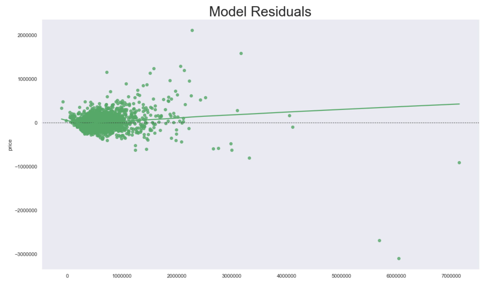

# Kings County Housing Predictions

By, Brendan Ferris

## Overview

Using the Kings County Dataset a predictive linear model was built in order to estimate home prices in Kings County, Washington. Through an initial inspection of the highest and lowest home prices in the county, it is clear that the northern region of the county was home the home of more affluent residents, while the lower portion of the county had the lowest valued homes:

While analyzing the data, I posed three questions:

1. Do areas that have more home renters have higher home prices?
2. Do houses built in the past after 2005 fetch higher prices than older houses?
3. Do the amount of available homes in an area have an effect on the price of the homes in that area?

My initial statistical analysis indicated that these were three significant features for housing prices.

Through non-linear modifications of my model features, I was able to improve my RMSE from a baseline score of 198822 to 122664. The polynomial features of my model sacrifice interpretability for accuracy.

## Next Steps

I believe that with a RMSE hovering between 137k and 166k-- my model performs well given the time constraints of the project. In the future, I believe I may be able to increase this score by including aggregate zip-code data collected from [UnitedStatesZipCodes.org](https://www.unitedstateszipcodes.org).

### For More Information

To see out full analysis, please refer to the [Jupyter Notebook](Kings_County_Housing_Project.ipynb)

For additional info, contact <brendanfrrs@gmail.com>

### Repository Structure
<pre>
├── EDA
│   ├── Cities_and_Unincorporated_King_County___city_kc_area-shp
│   │   ├── Cities_and_Unincorporated_King_County___city_kc_area.cpg
│   │   ├── Cities_and_Unincorporated_King_County___city_kc_area.dbf
│   │   ├── Cities_and_Unincorporated_King_County___city_kc_area.prj
│   │   ├── Cities_and_Unincorporated_King_County___city_kc_area.shp
│   │   ├── Cities_and_Unincorporated_King_County___city_kc_area.shx
│   │   └── Cities_and_Unincorporated_King_County___city_kc_area.xml
│   ├── __pycache__
│   │   └── scripts.cpython-36.pyc
│   ├── bedroomsfilled.csv
│   └── extradata.xlsx
├── King_County_Housing_Project.ipynb
├── README.md
├── final_model.pickle
├── holdout_data_prediction.ipynb
├── images
│   ├── KClogo_LONG.png
│   ├── distribution_of_predictions.png
│   ├── highest_and_lowest_priced_homes.png
│   ├── home_price_distribution.png
│   ├── king_county.jpg
│   └── model_residuals.png
├── kc_house_data_test_features.csv
├── kc_house_data_train.csv
└── preds
    └── housing_pred_Brendan_Ferris.csv<pre>
